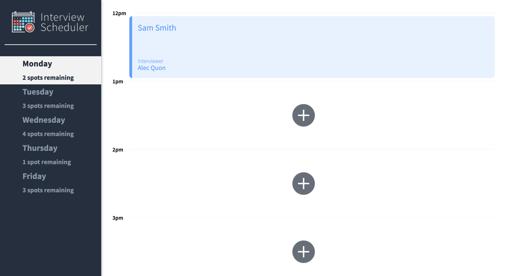
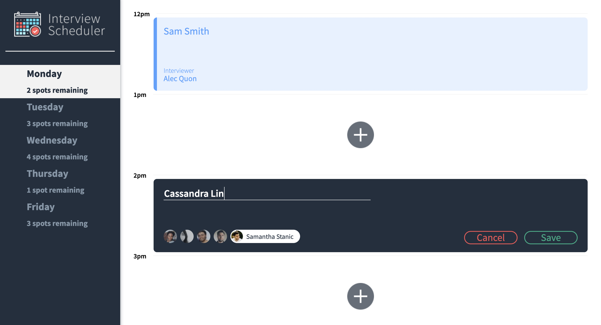
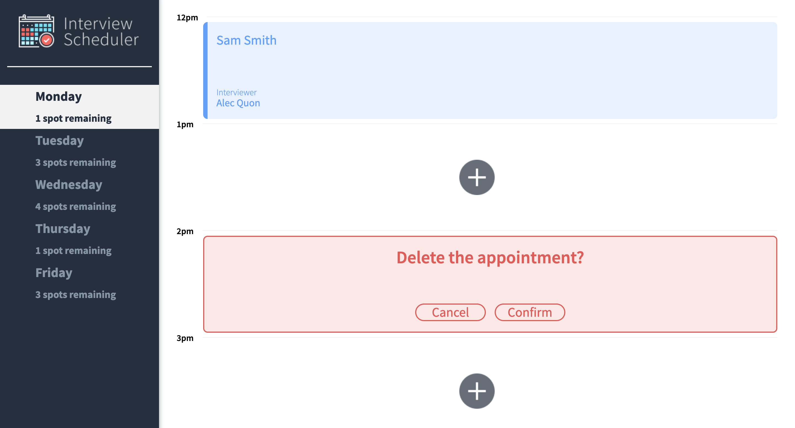

# Interview Scheduler

Scheduler is a web application built with React and Storybook that uses Jest and Cypress for testing and allows users to book an appointment to the given week.

# Final Product






## Setup

Install dependencies with `npm install`.

## Running Webpack Development Server

```sh
npm start
```

## Running Jest Test Framework

```sh
npm test
```

## Running Storybook Visual Testbed

```sh
npm run storybook
```
